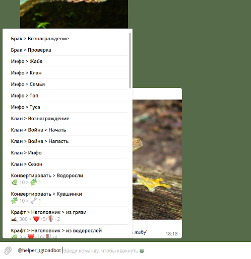

# Телеграм хелпер-бот для [@tgtoadbot](https://t.me/tgtoadbot)

## Setup
### 1. Скопировать и отредактировать .env файл
```
cp .env.sample .env
```
### 2. Проинициализировать mongo, добавить пользователя для планировщика задач
```
$ docker-compose up -d mongo
$ docker-compose run mongo bash
$ mongo --host mongo -u root
> use agenda
> db.createUser({user: "agenda", pwd: "agenda", roles: [{role: "readWrite", db: "agenda"}]})
```
### 3. Выйти из контейнера mongo и запустить все остальные сервисы
```
$ docker-compose up -d
```

🐸🐸🐸
🐸🐸🐸
🐸🐸🐸

## Inline режим
В inline режиме бот помогает быстро ввести команды жабабота, а также предоставляет полезные подсказки к ним.



## Команды
[1. Список запланированных задач](#1-список-запланированных-задач)<br>
[2. Отмена задачи](#2-отмена-задачи)<br>
[3. Запланировать кормежку](#3-запланировать-кормежку)<br>

### 1. Список запланированных задач
Команда `Моё расписание` показывает все запланированные задачи

### 2. Отмена задачи
Чтобы отменить одну из задач, нужно выполнить команду `Отменить задачу <ID>`

### 3. Запланировать кормежку
Чтобы запланировать кормежку, нужно ввести команду в формате
`Запланировать кормежку hh:mm`

После этого бот будет автоматически запрашивать нажатие кнопки **Покормить жабу** с промежутком в 12 часов после последней кормежки
